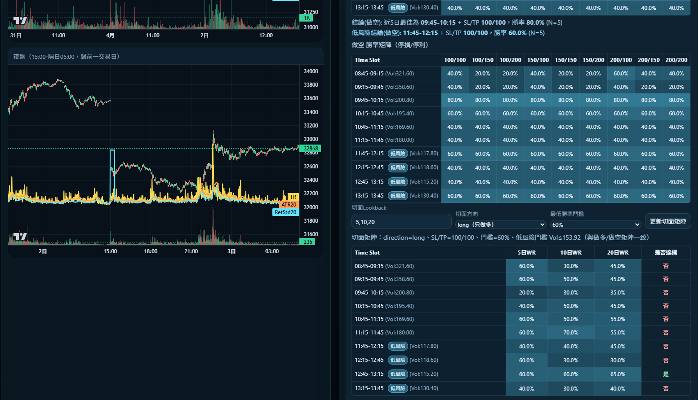

# Futures App

台指小型期貨資料抓取、整理、視覺化與 GitHub Pages 自動部署專案。

這個 repo 的目標是把 TAIFEX 原始成交 CSV 轉成可公開部署的靜態分析網站，提供：

- 日盤與夜盤 K 線檢視
- 30 分鐘時段波動排名
- 停損 / 停利回測
- 風險報酬矩陣
- 統計顯著性摘要

## Demo

https://wayne30691.github.io/futures_app/



## Features

- 自動抓取 TAIFEX 最近 30 天期貨成交資料
- 過濾台指小型期貨近月合約並整理成 1 分 K 資料集
- 以前端靜態頁方式呈現，不需要後端服務
- 透過 GitHub Actions 在 `main` 推送後自動部署，並於每天固定時間定時重建 GitHub Pages
- 公開站只發布 `site/` 內容，不公開 `raw/*.csv`

## Data Flow

```text
TAIFEX CSV ZIP
   -> scripts/fetch_all_taifex_fut_csv_30d.py
   -> raw/*.csv
   -> scripts/publish_raw_web.py
   -> web/  +  site/
   -> GitHub Pages
```

## Quick Start

### 1. 抓最近 30 天資料

```powershell
python scripts/fetch_all_taifex_fut_csv_30d.py
```

### 2. 建立正式輸出

```powershell
python scripts/publish_raw_web.py
```

### 3. 本機預覽

```powershell
python scripts/build_preview_web.py
python -m http.server 8080
```

開啟：

`http://127.0.0.1:8080/web/`

## Repository Layout

```text
futures_app/
├─ .github/workflows/        # GitHub Actions workflow
├─ docs/                     # 專案文件
├─ scripts/                  # 抓資料與建站腳本
├─ raw/                      # 原始 CSV
├─ web/                      # 本機預覽輸出
├─ site/                     # GitHub Pages 部署輸出
├─ src/                      # 其他模組
├─ config/                   # 設定
├─ data/                     # 額外資料
├─ output/                   # 額外輸出
└─ README.md
```

## Main Scripts

- `scripts/fetch_latest_taifex_fut_csv.py`
  抓最新一筆 TAIFEX 資料並輸出到 `raw/`
- `scripts/fetch_all_taifex_fut_csv_30d.py`
  抓最近 30 天資料並輸出到 `raw/`
- `scripts/build_preview_web.py`
  只產出 `web/`，適合本機預覽
- `scripts/publish_raw_web.py`
  產出 `web/` 與 `site/`，適合正式部署

## Deployment

GitHub Pages 使用 GitHub Actions 自動部署。

- workflow: [`.github/workflows/deploy-pages.yml`](.github/workflows/deploy-pages.yml)
- trigger: push 到 `main` 後立即部署
- schedule: 每天台灣時間 `16:50`
- deploy target: `site/`

Pages 設定請在 GitHub repository 中選：

- `Settings -> Pages`
- `Source: GitHub Actions`

## Notes

- `raw/*.csv` 不提交到 repo，建議只保留資料夾本身
- 若 repo 長期提交大量 CSV，git 歷史會快速膨脹
- `site/` 是部署結果，`web/` 是本機預覽結果

## Documents

- [GitHub Pages 設定說明](docs/GITHUB_PAGES_SETUP.md)
- [開發流程持續改進方向](docs/DEV_WORKFLOW_SUGGESTION.md)
- [公式與統計顯著性說明](docs/TAB_FORMULAS_AND_SIGNIFICANCE.md)
